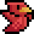

<p align="center">
  
</p>

# 🎮 Flappy Bird C++ com Allegro
---
<p align="center">
  
</p>

<p align="left">
  
</p>

<p align="center">
  
</p>

---

## 📋 Descrição do Problema
O objetivo deste projeto é implementar uma versão simplificada do jogo **Flappy Bird**, aliando:

1. **Padrão Orientado a Objetos** em C++, com hierarquias de classes para tela de jogo e UI.  
2. **Interface gráfica** de menu (login, cadastro, listagem e remoção de jogadores) usando Allegro 5.  
3. **Persistência** de cadastro de jogadores em arquivo de texto, com armazenamento de nome, senha, recorde, partidas jogadas e *conquistas*.
4. **Integração** consistente entre a manipulação dos arquivos e a execução do jogo em si.
5. **Execução robusta** do jogo, sem bugs, usando Allegro 5.
6. **Configuração personalizável** das variáveis do jogo.

O sistema deve permitir:  
- **Login/Logout** de usuários.  
- **Registro** de novos jogadores.  
- **Listagem paginada** de todos os jogadores, com destaque de recordistas e navegação entre páginas.  
- **Remoção** de jogadores, com confirmação de senha.  
- **Execução do jogo** propriamente dito (Flappy Bird).

---

## 📂 Estrutura do projeto
```sh
├─ assets/ # Imagens, sons e fontes
│ ├─ audio # Arquivos de audio
│ │  ├─ button_press.wav
│ │  ├─ point.wav
│ │  └─ ...
│ ├─ UI # Imagens de interface
│ │  ├─ achievements # Sprites das conquistas
│ │  │  ├─ achievements-01.png
│ │  │  ├─ achievements-02.png
│ │  │  └─ ...
│ │  ├─ score_box-1.png
│ │  ├─ home_button.png
│ │  └─ ...
│ ├─ fonts # Fontes utilizadas
│ │  ├─ pixelify_sans.ttf
│ │  └─ ...
│ ├─ scenario # Backgrounds
│ │  ├─ background.png
│ │  ├─ background_login.png
│ │  └─ ...
│ ├─ bird-1.png
│ ├─ bird-2.png
│ ├─ pipe.png
│ ├─ pipe_golden.png
│ └─ ... # Sprites básicos da animação do pássaro
├─ include/ # headers (.hpp)
├─ src/ # fontes (.cpp)
├─ bin/ # executáveis
├─ modeling/ # pdf's com a modelagem do projeto
├─ jogadores.txt # dados dos jogadores para persistência entre execuções
├─ obj/ # objetos
├─ Documentação # arquivos gerados pelo Doxygen
├─ Doxyfile # Configuração da geração do Doxygen
├─ tests/ # testes com doctest e doxygen
└─ Makefile # regras de compilação
```
---
## ⚙️ Visão Geral da Solução
### Principais Componentes
#### Menu Principal / Registro:
| Componente             | Responsabilidade                                      |
|------------------------|-------------------------------------------------------|
| **ui_object**          | Base para todos os elementos de interface             |
| **text_box / button**  | Entrada de texto e botões com feedback sonoro         |
| **login_screen**       | Tela de login + navegação para outras telas           |
| **register_screen**    | Cadastro de novos jogadores                           |
| **player_list_screen** | Listagem paginada, coroação de recordistas            |
| **remove_user_screen** | Remoção com confirmação de senha                      |
| **menu_audio**         | Gerenciamento de som e botão de mute/unmute           |
| **registration**       | Persistência em arquivo de jogadores                  |
| **menu**               | Controle de fluxo entre telas                         |

#### Jogo:
| Componente             | Responsabilidade                                      |
|------------------------|-------------------------------------------------------|
| **game_object**        | Base para todos os objetos do jogo                    |
| **bird_object**        | Objeto usado para manipular o pássaro no jogo.        |
| **pipe_object**        | Objeto usado para manipular os canos no jogo.         |
| **background_object**  | Objeto usado para manipular a paisagem de fundo.      |
| **image**              | Carrega imagens paradas.                              |
| **slider**             | Controla por meio do mouse um slider.                 |
| **moving_button**      | Botões que conseguem se mover durante a execução.     |
| **home_screen**        | Tela inicial da parte de gameplay.                    |
| **settings_screen**    | Tela onde se configura as opções do jogo com sliders. |
| **achievements_screen**| Tela onde se localiza as conquistas do jogador.       |
| **game_loop**          | Tela onde o jogo em si ocorre.                        |

  

---

## 🛠️ Principais Dificuldades Encontradas

1. **Persistência em Arquivo**  
   Manter `std::fstream` sem corromper dados e tratar erros de I/O.  
2. **Testabilidade**  
    Conseguir simular eventos do Allegro sem uma interface gráfica "real".
3. **Paginação da tela de listagem**
    Criar uma lógica que fosse capaz de listar todos os jogadores considerando um espaço finito da tela 800x600 disponível.
---

## ✨ Extras Implementados

- **Melhoria da parte gráfica:** Sprites personalizados para botões e objetos do jogo.
- **Sistema de conquistas:** Conquistas que consideram dados persistentes entre execuções do programa.
- **Configuração personalizada com "sliders":** Possibilidade de alterar variáveis do jogo com interface amigável com "sliders".

---

## ▶️ Como Compilar e Executar

1. **Pré-requisitos**  
   - Allegro 5 (+ addons audio, image, ttf, primitives, acodec)  
   - g++ (C++17) + pkg-config  
2. **Compilar**  
   ```sh
   make
    ```
    → gera `main `(jogo) e arquivos de teste(`testregistration`,`test_main_menu`)
3. **Executar**
     ```sh
     cd bin
     ./main
     ```
